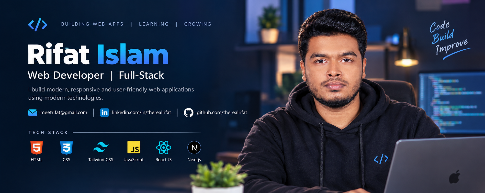

  

# 👋 Hi, I'm Rifat Islam

### 💻 Web Developer | Full-Stack Developer

I’m a passionate Web Developer focused on building modern, responsive, and user-friendly web applications.

I enjoy learning new technologies, solving problems, and turning ideas into real-world web applications.

---

## 👨‍💻 About Me

- 🔭 I’m currently exploring **Next.js** and modern full-stack development.
- 🌱 I’m continuously improving my skills in **JavaScript, React.js, TypeScript & Next.js**.
- 💻 I’m building responsive and user-friendly web applications.
- 🚀 I’m interested in **Frontend & Full-Stack Web Development**.
- 🧩 I enjoy solving programming problems and learning through projects.
- 📚 I believe in learning by building real-world projects.
- 🎯 My goal is to become a professional **Full-Stack Web Developer**.

---

## 🛠️ Tech Stack

### Frontend

  

### Tools & Technologies

  

---

## 🚀 Currently Working On

- 🌐 Building modern responsive web applications
- ⚛️ Exploring advanced **React.js** concepts
- ▲ Learning and building projects with **Next.js**
- 🔷 Improving my **TypeScript** skills
- 🧠 Practicing JavaScript problem solving
- 🛒 Working on real-world frontend projects
- 🔌 Learning how frontend applications communicate with APIs

---

## 📊 GitHub Stats

  
  

---

## 💻 Most Used Languages

  

## 📈 GitHub Activity

  

---

## 🤝 Connect With Me

  

  

  

---

## 🧰 Skills

  

---

## 🎯 2026 Goals

- 🚀 Become a professional Full-Stack Web Developer
- ⚛️ Build production-ready React applications
- ▲ Become confident with Next.js
- 🔷 Improve TypeScript skills
- 🌐 Build and deploy real-world projects
- 🤝 Contribute to open-source projects
- 📈 Grow consistently on GitHub

---

## ⚡ Fun Fact

> I don't just want to learn technologies —  
> **I want to build things with them.**

---

### 💙 Thanks for visiting my profile!

⭐ Feel free to explore my repositories and connect with me.
