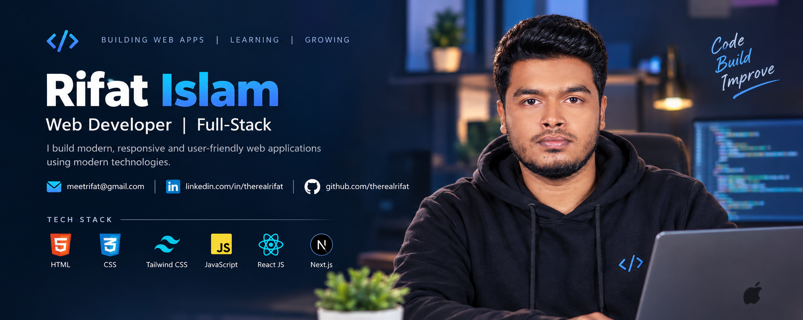

  

<h1 align='center'>👋 Hi, I'm Rifat Islam</h1>

  

  

<h2> 🔭 I build things with JavaScript, React, and Node.js</h2>

## 👨💻 About Me  
I am a passionate aspiring Full-Stack Web Developer dedicated to building responsive, modern, and user-friendly web applications. Currently, I am deeply focused on exploring Next.js and refining my skills across the core web ecosystem, including JavaScript, React.js, and TypeScript. I strongly believe in learning by doing, which is why I continuously challenge myself by solving programming problems and building real-world projects. Driven by curiosity and a commitment to continuous growth, my goal is to deliver impactful software solutions while constantly pushing the boundaries of frontend and full-stack development.

---

## 🛠️ Tech Stack

### Frontend

  

### **Backend**

### Tools & Technologies

  

---
## 🤝 Connect With Me

  

  

  

---
## 🚀 Currently Working On

- 🌐 Building modern responsive web applications
- ⚛️ Exploring advanced **React.js** concepts
- ▲ Learning and building projects with **Next.js**
- 🔷 Improving my **TypeScript** skills
- 🧠 Practicing JavaScript problem solving
- 🛒 Working on real-world frontend projects
- 🔌 Learning how frontend applications communicate with APIs

---

## 📊 GitHub Stats

  
  

---

## 💻 Most Used Languages

  

## 📈 GitHub Activity

  

---

---

## 🧰 Skills

  

---

## 🎯 2026 Goals

- 🚀 Become a professional Full-Stack Web Developer
- ⚛️ Build production-ready React applications
- ▲ Become confident with Next.js
- 🔷 Improve TypeScript skills
- 🌐 Build and deploy real-world projects
- 🤝 Contribute to open-source projects
- 📈 Grow consistently on GitHub

---

## ⚡ Fun Fact

> I don't just want to learn technologies —  
> **I want to build things with them.**

---

### 💙 Thanks for visiting my profile!

⭐ Feel free to explore my repositories and connect with me.

  

